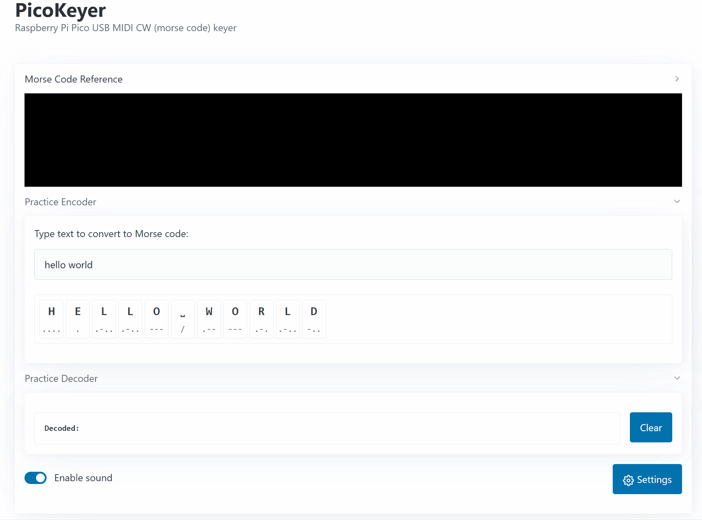
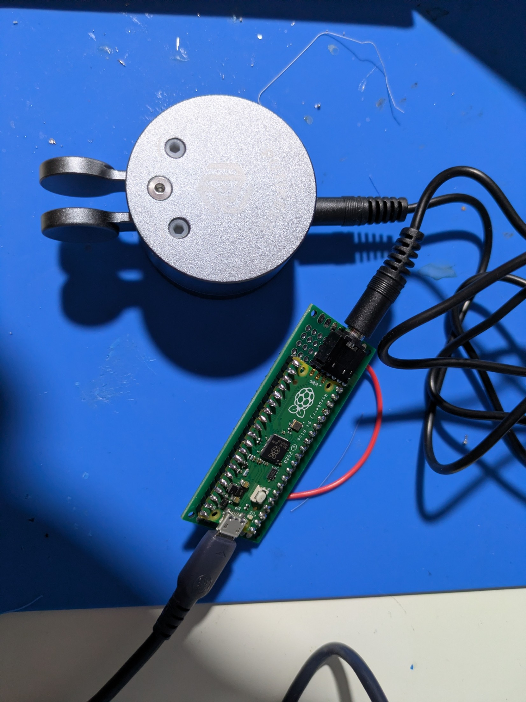
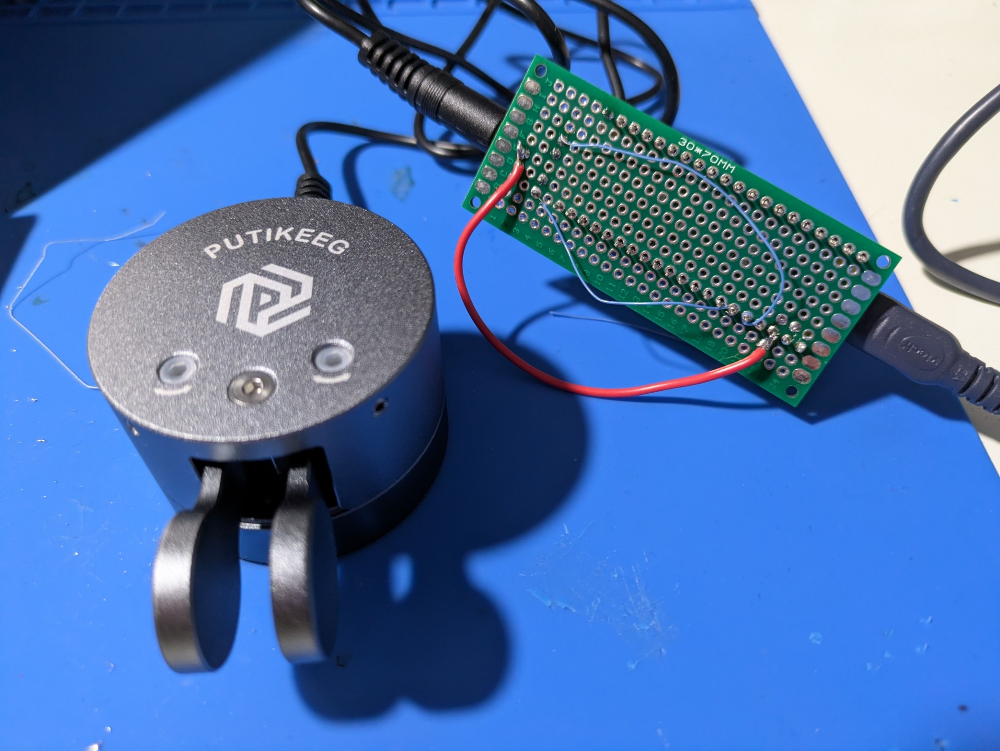

# PicoKeyer

PicoKeyer is a CW keyer for the [Raspberry Pi Pico](https://www.raspberrypi.com/products/raspberry-pi-pico/) that let's you to practice CW (morse code) in Desktop or Mobile browser that supports the [Web MIDI API](https://developer.mozilla.org/en-US/docs/Web/API/MIDIAccess#browser_compatibility). PicoKeyer has many configurable options, including the key type, words per minutes rate, LED/GPIO output, MIDI parameters; all within your browser. The PicoKeyer also provides a USB MIDI interface that enables you to use any MIDI app of your choice to record or listen to your CW.

[PicoKeyer Browser App](https://cw.grabosky.net/)

## Features
* Original features from [bontebok](https://github.com/bontebok/PicoKeyer):
   * Web MIDI support for paddle or straight key
   * Firmware for a Pi Pico to emulate a MIDI device
   * Configuration of Pico device settings
   * Visualization of CW and tones
* Added features of this version:
   * Morse Code quick reference
   * Type out a phrase and see what you should type
   * Attempt to decode the message typed
   * Auto clear the decoded message after 4 seconds of inactivity
   * encoding/decoding from [Syncthetic](https://github.com/Syncthetic/MorseCode)
   * Store web UI settings in localStorage

## Getting Started
You will need a Raspberry Pi Pico based on the RP2040 chip and a CW key (straight or paddles). The Pi Pico is available in a variety of configurations, any of them should work. If you do not already have a Pi Pico, I recommend picking up either an original Raspberry Pi Pico or a Waveshare RP2040-Zero board as I have tested both. You can find the original [Raspberry Pi Pico](https://www.raspberrypi.com/products/raspberry-pi-pico/), [Waveshare RP2040-Zero](https://www.waveshare.com/rp2040-zero.htm), or a clone from $3-10/ea on Amazon, Aliexpress, or at retailers like Micro Center. If you want to use the case design included in the [waveshare_rp2040_case](https://github.com/bontebok/PicoKeyer?tab=readme-ov-file#waveshare-rp2040-zero-build) directory, you will need a Waveshare RP2040-Zero or clone.

In addition to the Pi Pico, you will also need a way to connnect your RP2040 to your key. Most keys use a standard 3.5MM (1/8") stereo jack, however bare wires will also work fine. If you want to use the standard 3.5MM jack, I recommend the Lsgoodcare headphone jacks in the link below.

Amazon Links (non-affiliate)
* [Raspberry Pi Pico (Quantity 2) $10](https://www.amazon.com/Raspberry-Development-Dual-core-Processor-Integrated/dp/B0CPMBRVDX/)
* [Waveshare RP2040 Zero (Quantity 3) $20](https://www.amazon.com/RP2040-Zero-High-Performance-Microcontroller-Castellated-Boards-3pcs/dp/B0B2ZFGSMD/)
* [Lsgoodcare 10PCS 3.5MM Female Headphone Stereo Jack](https://www.amazon.com/dp/B01CVGD4UI)

## Assembly
The Raspberry Pi Pico comes with breadboard-friendly header pins, so it technically is possible that you could assemble a PicoKeyer using breadboard. However, I recommend that you solder a 3.5MM jack or a 3.5MM headphone-style cable directly to the Pi Pico as this will give you the best result. If you have basic soldering skills, assembly should be a breeze.

### Straight Key
The simplest configuration is a straight key as only two wires are needed. The common (ground) of the key should be wired to one of the Raspberry Pi Pico ground pins, while the other contact needs to be wired to any available GPIO pin. Take note of the GPIO pin number as you will need to set that pin in the settings.

| Pi Pico Pin | 3.5MM TRS Jack Pin |
| ----------- | ------------------ |
| GND         | Pin 1 / (sleeve)   |
| Any GPIO    | Pin 2 / (tip)      |

### Paddles
Three wires are needed to connect a paddle key to the PicoKeyer. The common (ground) of the key should be wired to one of the Raspberry Pi Pico ground pins, while the other two contacts (left and right paddle) need to be wired to any free GPIO pin. Take note of each GPIO pin number as you will need to set that pin in the settings.

| Pi Pico Pin | 3.5MM TRS Jack Pin |
| ----------- | ------------------ |
| GND         | Pin 1 / (sleeve)   |
| Any GPIO    | Pin 2 / (tip)      |
| Any GPIO    | Pin 3 / (ring)     |

## Firmware Installation
Head over to [Releases](https://github.com/bontebok/PicoKeyer/releases) and download the latest PicoKeyer.uf2 firmware. Plug in your Raspberry Pi Pico and open the RPI-RP2 drive. If the drive does not appear, hold down the Boot button on the Pi Pico before plugging it it. Copy the PicoKeyer.uf2 file to the RPI-RP2 drive. Once the firmware has finished copying, open the [PicoKeyer Browser App](https://cw.grabosky.net/) in a browser that supports the Web MIDI API to configure your PicoKeyer.

## PicoKeyer Web Application
The [PicoKeyer Browser App](https://cw.grabosky.net/) provides a USB MIDI interface and allows you to directly configure the PicoKeyer from your browser. You will need a browser that supports the [Web MIDI API](https://developer.mozilla.org/en-US/docs/Web/API/MIDIAccess#browser_compatibility) (note: Safari does not support the Web MIDI API). Plug in your PicoKeyer to a free USB port and open the PicoKeyer Browser App. The app will prompt you for permission to access MIDI Devices, once allowed the application should automatically detect the PicoKeyer. If detection was successful, you will see the Settings button.

Click on the Settings button to begin configuring your PicoKeyer. Choose the key type to continue.

Configure the values for the Words Per Minute, Dit Paddle GPIO, Dah Paddle GPIO. All other values can be left default. (note: Other GPIO pin modes are supported, but if you have connected your common wire to GND on the Pi Pico, you will want to leave it on Pull Up mode)

Once you are satisfied with your options, you can press Apply to test. If successful, pressing your key should produce a visual indicator in the black box. You can enable sound by clicking on the slider to hear a CW tone. If you are satisfied, press Save to save the settings to your Pi Pico's NVRAM so the settings will persist between reboots.

